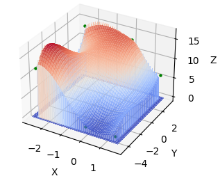
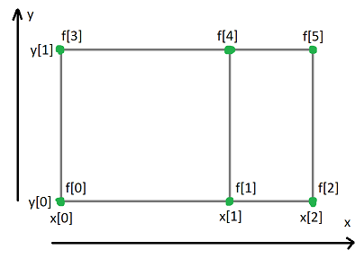
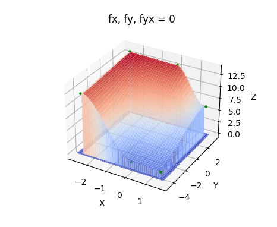

# bicubic
A base for bicubic interpolation

This projects provides the basis for bicubic interpolation. It is meant to allow any kind of interpolation. <br>
If you need something ready to use check out the [makima_spline](https://crates.io/crates/makima_spline)



## HowTo

```rust
use bicubic;
```
create data
```rust
// x coordinates
let x = vec![-2.5, 0.0, 1.5];
// y coordinates
let y = vec![-4.5, 3.2];
// the value at (x,y) or z if that's how you see it
let f = vec![12.4, 1.45, 1.33, 13.4, 13.2, 6.];

// for simplicity, the next values are zero (the values depend on the type of interpolation used)
// first derivative along x direction for each point
let fx = vec![0.0; f.len()];
// first derivative along y direction for each point
let fy = vec![0.0; f.len()];
// cross derivative (untested)
let fxy = vec![0.0; f.len()];
```
The following image shows the layout of the data. 
fx, fy, & fxy is placed the same way as f

Note: x & y needs to be sorted in ascending order. Make sure your f values will swap indices when sorting as well 



build the bicubic struct from the data
```rust
let bci = bicubic::from_vec(&x, &y, &f, &fx, &fy, &fxy);
``` 
To sample do this:
```rust
let z = bicubic.sample(x, y);
```

